# Vigilancia Obstétrica Municipal

## Sistema MLOps end-to-end para predicción de vulnerabilidad de mortalidad materna en Colombia

### Descripción general

Plataforma MLOps completa que predice el número esperado de casos de **Morbilidad Materna Extrema (MME, evento SIVIGILA 549)** por municipio × semestre en Colombia, usando exclusivamente datos públicos. El sistema integra ingesta multi-fuente, modelado de conteos con offset poblacional, registry versionado, serving online con CI/explicabilidad, y observabilidad full-stack.

**Resultado principal**: Spearman departamental sobre test 2022 = **0.836** (gate Go/No-Go ≥ 0.30). Backtest rolling 4 ventanas (2019–2022): cv_spearman = 0.073 (modelo estable temporalmente).

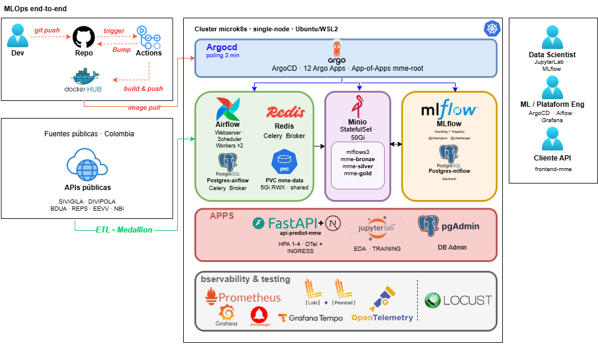

---

## Qué resuelve este sistema (dominio MME)

### El problema

La **Morbilidad Materna Extrema (MME)** es el conjunto de complicaciones graves que casi causan la muerte de una gestante. En Colombia se notifica al evento **549 de SIVIGILA** (INS) con razón nacional 2023 ≈ 65,5 por 1.000 nacidos vivos, pero la carga está concentrada en muy pocos territorios: la razón departamental llega a ser **2 a 6 veces el promedio** en zonas con población Wayúu, Sikuani o Embera, y la dispersión municipal es aún mayor.

El **Plan de Aceleración para la Reducción de la Mortalidad Materna (PAREMM v5)** del MinSalud necesita decidir, sobre **1.122 municipios**, dónde abrir UCI obstétrica, dónde reforzar las rutas RIAS-MPN, dónde mandar brigadas extramurales y dónde fortalecer las UPGD. Hoy esa decisión se toma con boletines cualitativos del INS y juicio experto de las Direcciones Territoriales de Salud, sin una cuantificación reproducible de la vulnerabilidad estructural por municipio y sin distinguir entre **"municipio de alta vulnerabilidad real"** y **"municipio que simplemente no notifica"**.

### Pregunta de investigación

> ¿Es posible construir un **Índice de Vulnerabilidad Obstétrica Municipal**, explicable e interpretable, que operacionalice cuantitativamente el modelo de las **3 demoras de Thaddeus & Maine (1994)** usando exclusivamente datos públicos colombianos, para priorizar la asignación de recursos de PAREMM v5?

Las features del modelo se mapean a las tres demoras del marco clínico:

| Demora | Concepto | Features que aporta el modelo |
|---|---|---|
| **I** — decidir buscar atención | reconocimiento de signos, decisión familiar | NBI inasistencia escolar, edad media de la madre |
| **II** — acceso al servicio | distancia, transporte, barreras económicas y culturales | NBI total, % rural, % subsidiado BDUA, omisión censal, % indígena |
| **III** — atención adecuada y oportuna | calidad clínica, oferta hospitalaria | IPS nivel 3 disponible, camas obstétricas, UCI adulto, score de capacidad obstétrica REPS |

### Encuadre ML (no es serie de tiempo)

Es **regresión de conteos sobre panel municipal**, no forecasting:

```
Unidad:    (municipio, semestre)              n = 1.122 × 7 años × 2 semestres ≈ 15.708
Target:    y_it ∼ NegBin(μ_it, θ)
log μ_it = log(NV_esperados_it) + xᵢₜ·β
Razón:     y_it · 1.000 / NV_esperados_it     [casos MME por 1.000 nacidos vivos]
```

El modelo predice **la tasa esperada dado el perfil estructural actual**, no qué pasará el próximo semestre. La diferencia entre razón observada y razón predicha es lo que vale operacionalmente: residual positivo grande sugiere exceso real o subregistro súbito; residual negativo sostenido sugiere municipio silencioso.

### Familia de modelos y selección

| Modelo | Rol | Por qué |
|---|---|---|
| **GLM Poisson** con offset `log(NV)` | baseline interpretable | Estándar epidemiológico INS/OMS — todo boletín se reporta así |
| **GLM Negative Binomial** | baseline robusto | Si `dispersion_ratio > 1,5` (var > mean), reemplaza al Poisson |
| **LightGBM Poisson + Optuna** | challenger no-lineal | Captura interacciones (NBI alto × sin IPS nivel 3) |
| **Clayton-Kaldor Empirical Bayes** | suavizamiento previo | Obligatorio en municipios con NV < 50/año |

El champion se promueve por gate combinado en MLflow (`new ≥ prev × 0,95 OR new ≥ 0,65` sobre Spearman departamental), con backtest rolling 4 ventanas (`cv_spearman = 0,073`) confirmando estabilidad temporal.

### Qué entrega el sistema (lo que ve el usuario en la API y el frontend)

| Output | Decisión que soporta | Usuario |
|---|---|---|
| `razon_predicha(municipio)` + IC bootstrap 90% | Ranking territorial por vulnerabilidad | PAREMM — asignación de recursos |
| Residual = observada − predicha | Detección de excesos reales o subregistro inesperado | INS Vigilancia + DTS |
| SHAP global (`/model/info`) | Priorización de políticas: ¿reducir NBI o abrir UCI-O? | MinSalud policy |
| SHAP por municipio (drill-down `/mme/municipio/[cod]`) | Diagnóstico cualitativo del perfil de vulnerabilidad | Direcciones Territoriales |
| Ranking departamental ordenado | Vista priorizada para gestión territorial | DTS, secretarías de salud |

### Resultado actual (champion en producción)

- **Spearman departamental sobre test 2022** = **0,836** (gate Go/No-Go ≥ 0,30, ampliamente superado).
- **Backtest rolling** 2019–2022, cv = 0,073 → modelo estable temporalmente.
- **Precision@top-50 municipios** = 0,24 — útil como ranking pero limitado para decisiones individuales (por construcción: hay subregistro).
- Interpretación operacional: si MinSalud toma los **top-10 departamentos** del ranking predicho, **≈9 de 10** coinciden con el top-10 real observado en 2022.

> **Disclaimer ecological fallacy.** El modelo opera a nivel agregado municipio × semestre. **No predice riesgo individual de una gestante.** Un municipio con alta vulnerabilidad promedio no implica que toda gestante en ese municipio esté en riesgo alto. Es una herramienta de asignación de recursos, no un clasificador clínico.

Detalle metodológico completo: [code/docs/mme/ml-problem-definition.md](code/docs/mme/ml-problem-definition.md) y [code/docs/mme/model-evaluation.md](code/docs/mme/model-evaluation.md).

---

## Arquitectura del sistema

A diferencia del repo de referencia (3 máquinas), esta solución corre sobre **microk8s single-node** (extensible a multi-host con `microk8s join`), con 5 namespaces lógicos:

| Namespace | Componentes | Función |
|---|---|---|
| `airflow` | scheduler, triggerer, workers × 2, webserver, redis, postgres, statsd | Orquestación ETL + ML |
| `mlflow` | mlflow-tracking, postgres-mlflow | Tracking + Registry |
| `data` | minio (StatefulSet, PVC 50Gi) | Object store S3 |
| `apps` | api-predict-mme, frontend-mme, jupyterlab, pgadmin | Serving + UI |
| `observability` | prometheus, grafana, loki, tempo, locust | Métricas / logs / trazas / load |
| `argocd` | server, controller, repo-server | GitOps reconciler |

<!-- TODO 📸 capturar output de `microk8s kubectl get pods -A` con todos los namespaces Running/Ready -->

### Stack desplegado

- **Orquestación**: Apache Airflow 2.10.5 + CeleryExecutor + Redis broker.
- **Tracking & Registry**: MLflow 3.3.2 (chart bitnami) + PostgreSQL backend + MinIO artifact store.
- **Storage**: 2× PostgreSQL 13 (airflow / mlflow) + MinIO S3-compatible.
- **Modelado**: LightGBM Poisson + Optuna TPE 50 trials · GLM NegBin baseline · SHAP global.
- **Serving**: FastAPI + Uvicorn + bootstrap CI residual al 90%.
- **Frontend**: Next.js 14 App Router + Tailwind + Recharts + Server Actions.
- **Observabilidad**: kube-prometheus-stack + Loki + Tempo + Locust load testing.
- **GitOps**: ArgoCD App-of-Apps + GitHub Actions matrix → Docker Hub `luisfrontuso10/mme-*`.
- **Cluster**: microk8s 1.28+ single-node sobre Ubuntu 22.04 / WSL2 (parametrizado vía `.env`).

---

## CI/CD pipeline

Tres workflows GitHub Actions cubren build, bump y deploy de docs:

```
[git push main]
       │
       ├─→ build-and-push.yml  (5 imágenes en paralelo, multi-arch)
       │       │
       │       ▼
       │   Docker Hub (luisfrontuso10/mme-*)
       │       │
       │       ▼
       │   bump-image-tags.yml  (sed -i deployment.yaml + commit main)
       │       │
       │       ▼
       │   ArgoCD detect (3 min) → sync → rolling update
       │
       └─→ docs.yml  (mkdocs build --strict → GitHub Pages)
```

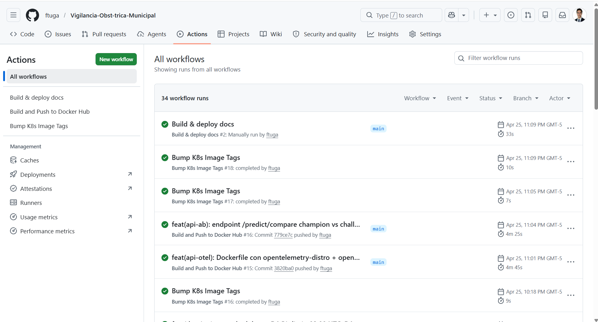

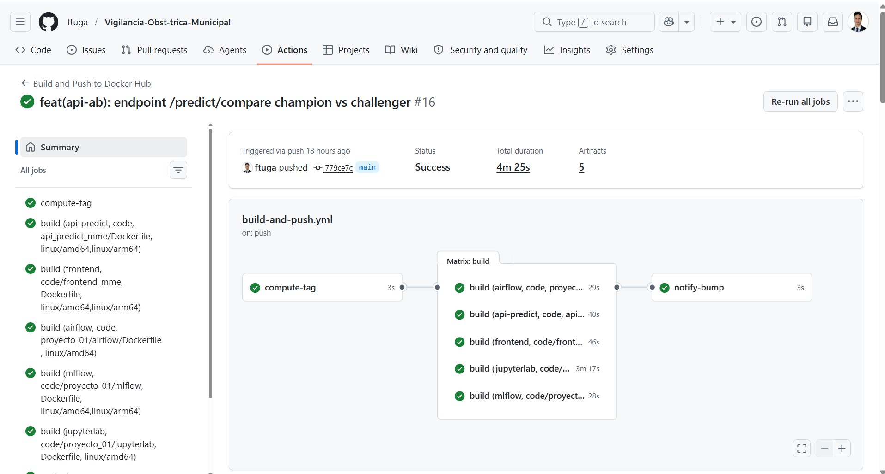

Las imágenes se publican en Docker Hub bajo el namespace `luisfrontuso10/`:

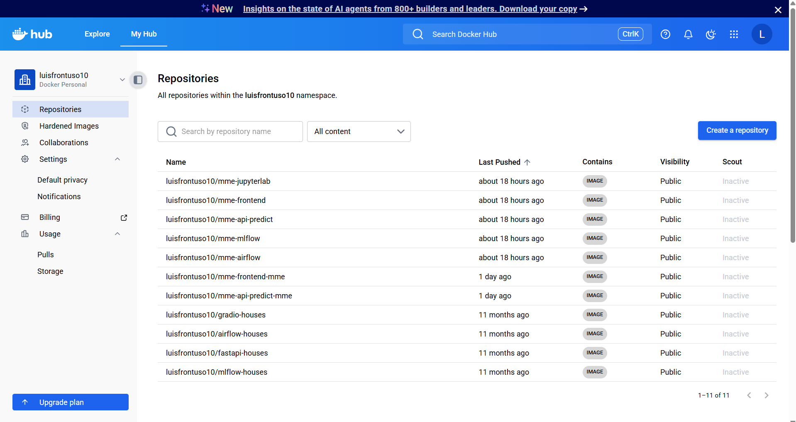

### Sistema de tagging

```bash
# Rama main (producción)
TAG=YYYYMMDD-{short-sha}    # ej: 20260425-779ce7c

# Ramas de desarrollo
TAG={branch-name}-{short-sha}   # ej: feat-new-feature-abc1234
```

### Configuración de secrets

```bash
gh secret set DOCKERHUB_USERNAME --body "luisfrontuso10"
gh secret set DOCKERHUB_TOKEN --body "<PAT-read+write+delete>"
# GITHUB_TOKEN auto-provisto
```

Permisos por workflow:

| Workflow | Permisos |
|---|---|
| `build-and-push.yml` | `contents: read` |
| `bump-image-tags.yml` | `contents: write` |
| `docs.yml` | `contents: read`, `pages: write`, `id-token: write` |

Detalle completo: [docs/ci-cd.md](docs/ci-cd.md).

---

## GitOps con ArgoCD

Patrón **App-of-Apps**: una sola `Application` raíz (`mme-root`) descubre las 12 apps hijas en `k8s/argo-cd/apps/`. Charts Helm upstream usan **multi-source** con values en este repo (single source of truth).

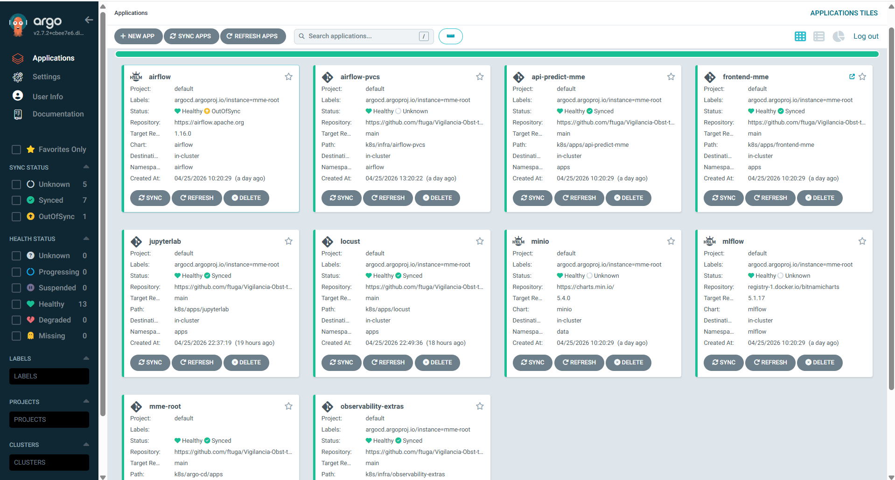

Drilldown de una app individual (ejemplo `airflow`) mostrando el árbol completo de workloads (deployments, statefulsets, replicasets, pods, services) gestionados por ArgoCD:

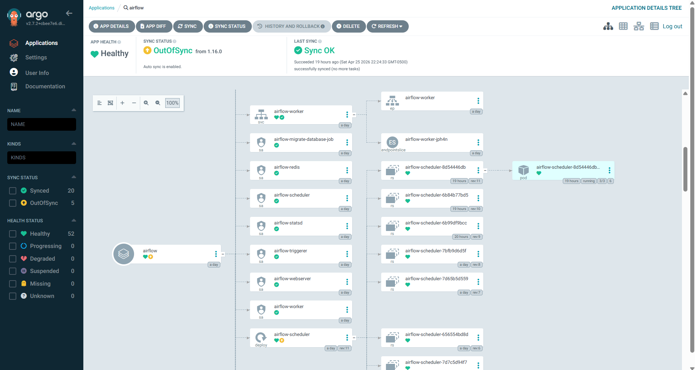

### Apps gestionadas

| App | Tipo | Sync policy |
|---|---|---|
| postgres-airflow, postgres-mlflow | Helm bitnamilegacy | automated, **sin prune** |
| minio | Helm bitnamilegacy | automated, sin prune |
| mlflow | Helm bitnamilegacy 3.3.2 | automated, self-heal |
| airflow | Helm apache-airflow 1.16.0 | automated, prune manual |
| airflow-pvcs | manifests propios | automated |
| api-predict-mme, frontend-mme, jupyterlab, pgadmin | manifests propios | automated full |
| locust, observability-extras | manifests propios | automated full |

Detalle completo: [docs/gitops.md](docs/gitops.md).

---

## Componentes — Plataforma de datos y ML

### Apache Airflow — orquestación

3 DAGs activos:

- `0-mme_reset_environment` (manual, gate `confirm_reset=YES`).
- `1-mme_etl_medallion` (diario 02:00 UTC) — ingesta multi-fuente bronze → silver → gold.
- `2-mme_train_and_promote` (diario 04:00 UTC) — drift check → train → validate → promote @champion.

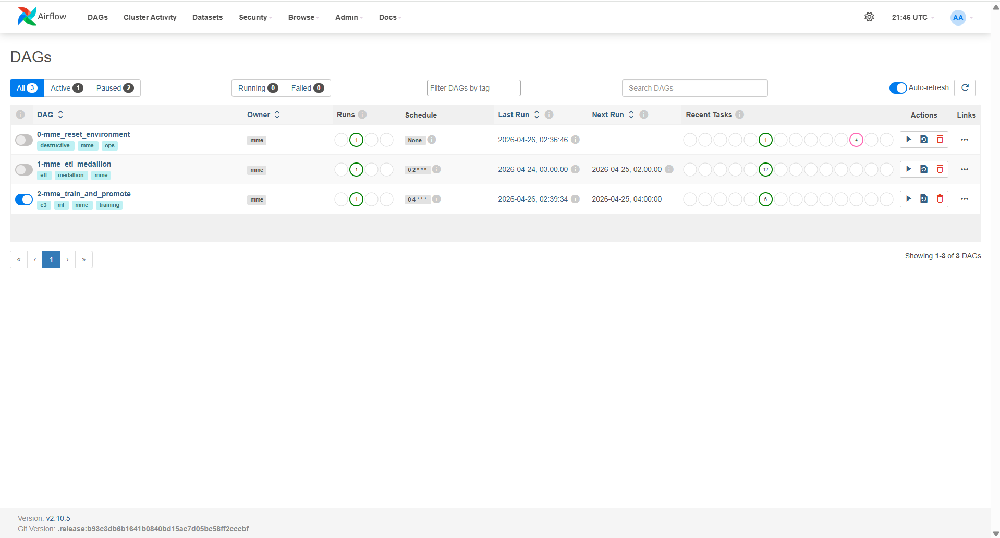

#### DAG 0 — `0-mme_reset_environment` (manual, destructivo)

Reset idempotente del entorno (PVC + MinIO + MLflow Registry). La task `confirm_gate` es un short-circuit: si `confirm_reset != YES` (Variable de Airflow), todas las tasks downstream quedan en `skipped`.

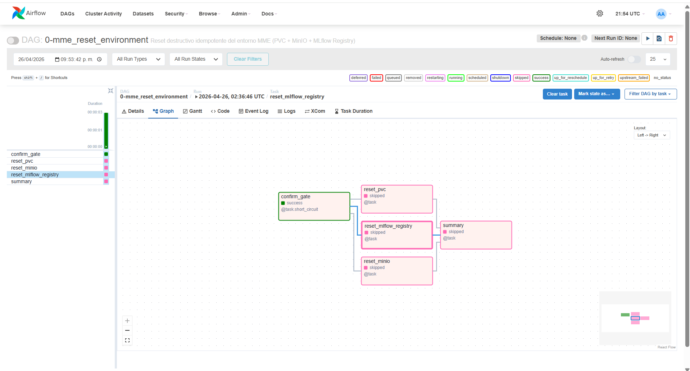

#### DAG 1 — `1-mme_etl_medallion` (diario)

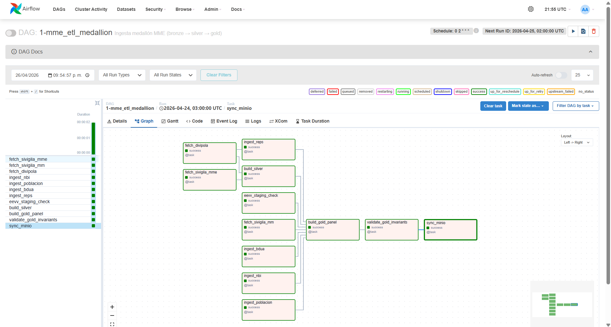

#### DAG 2 — `2-mme_train_and_promote` (diario)

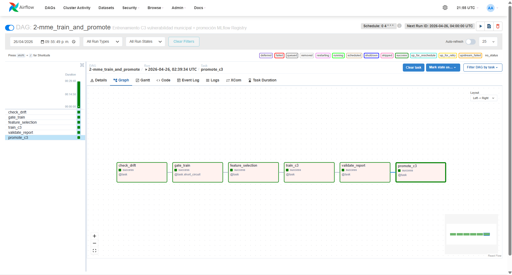

### MLflow — tracking + registry

Backend PostgreSQL + artifact root `s3://mlflows3` (MinIO). Modelo `mme_vulnerability_baseline` con alias `@champion` (y eventualmente `@challenger` para A/B).


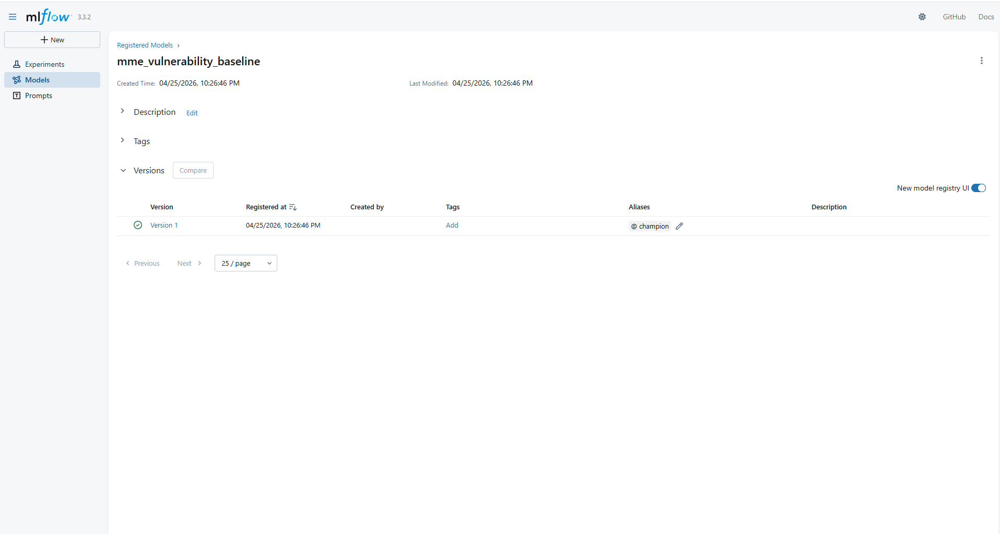

### MinIO — object store

Buckets:

- `mlflows3` — artifacts MLflow (modelos, plots, signature).
- `mme-bronze`, `mme-silver`, `mme-gold` — medallón replicado del PVC.

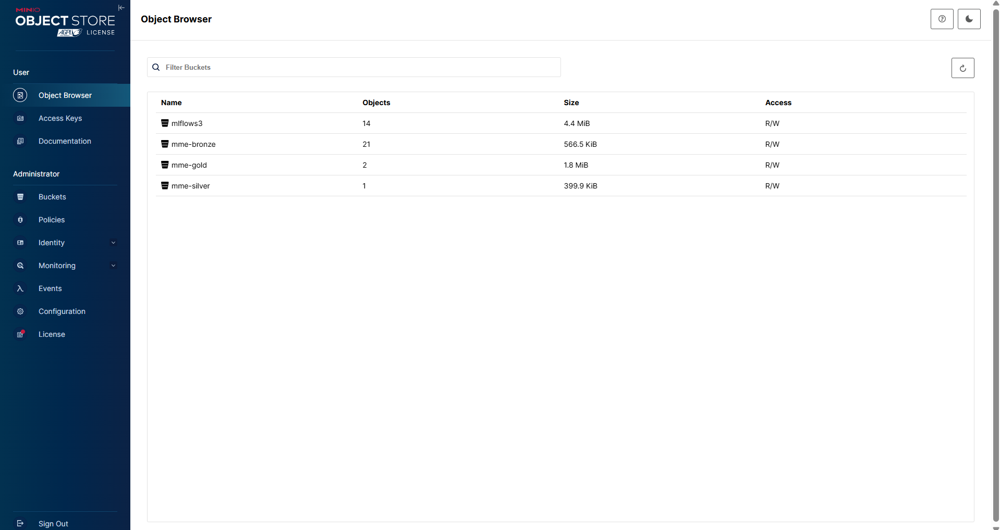

### pgAdmin — exploración Postgres

Para inspeccionar la metadata de Airflow (DAG runs, task instances) y backend MLflow.

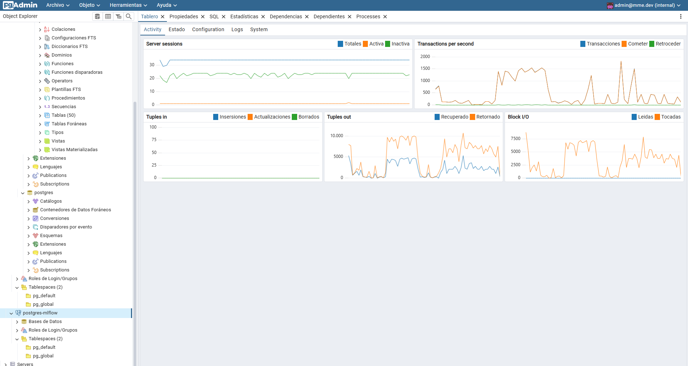

### JupyterLab — desarrollo y EDA

Notebooks con paquete `mme` montado read-only desde el repo. Sin token (red privada cluster).

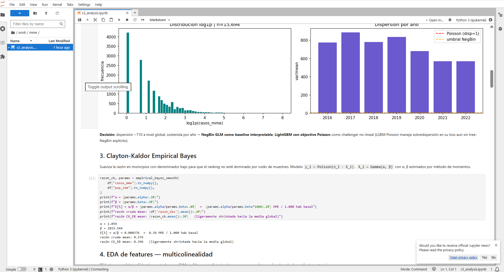

### Kubernetes Dashboard — administración del cluster

Provisto via `microk8s enable dashboard`. El script `k8s/scripts/dashboard.sh` configura un ServiceAccount con `cluster-admin`, expone el Service como NodePort `30444` y copia el token al portapapeles. Detalle: [k8s/README.md](k8s/README.md#kubernetes-dashboard).

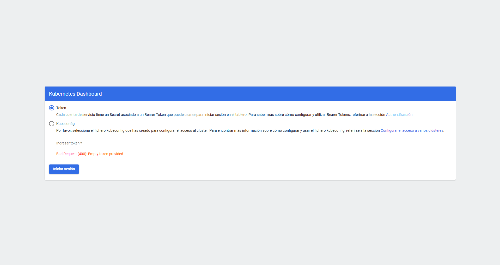

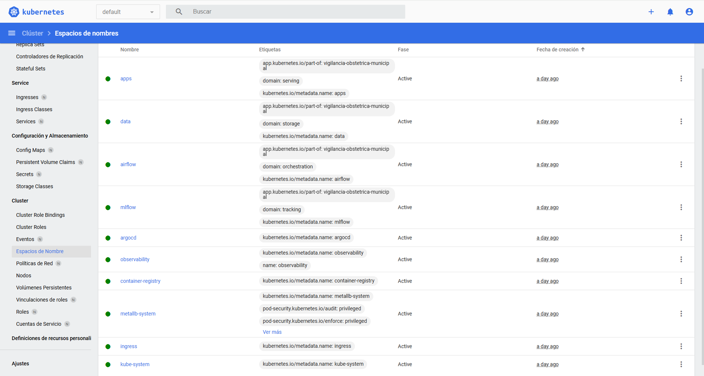

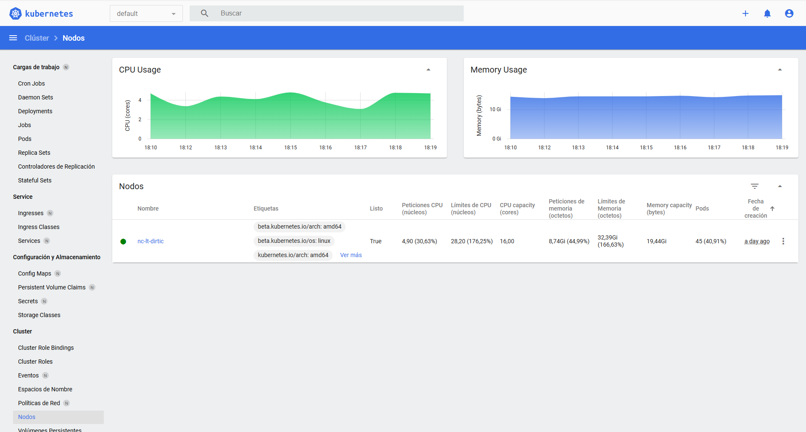

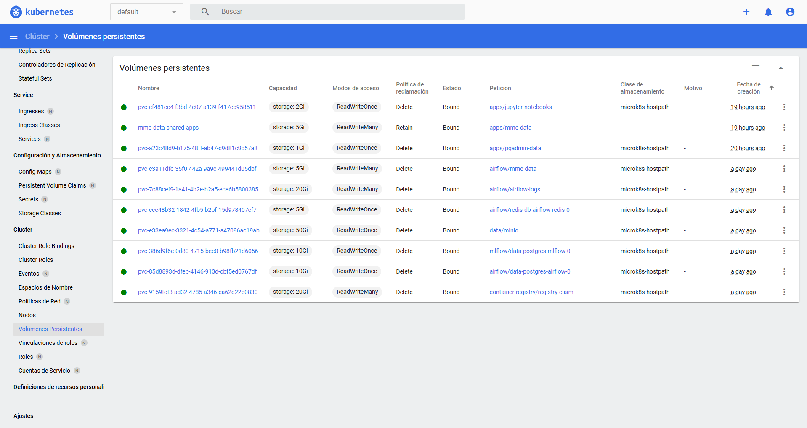

---

## Componentes — Serving

### FastAPI — `api-predict-mme`

Endpoints:

| Método | Path | Descripción |
|---|---|---|
| GET | `/healthz` | Liveness |
| GET | `/readyz` | Readiness (champion + panel + auth) |
| GET | `/model/info` | Metadata del champion activo |
| POST | `/model/reload` | Recarga sin restart |
| POST | `/predict/municipio` | Predicción puntual + CI bootstrap |
| POST | `/predict/batch` | Batch de N municipios |
| POST | `/predict/compare` | A/B champion vs challenger |
| GET | `/predict/ranking` | Top-K muni de un dpto |

Auto-instrumentado con OpenTelemetry → Tempo. HPA 1–4 réplicas.

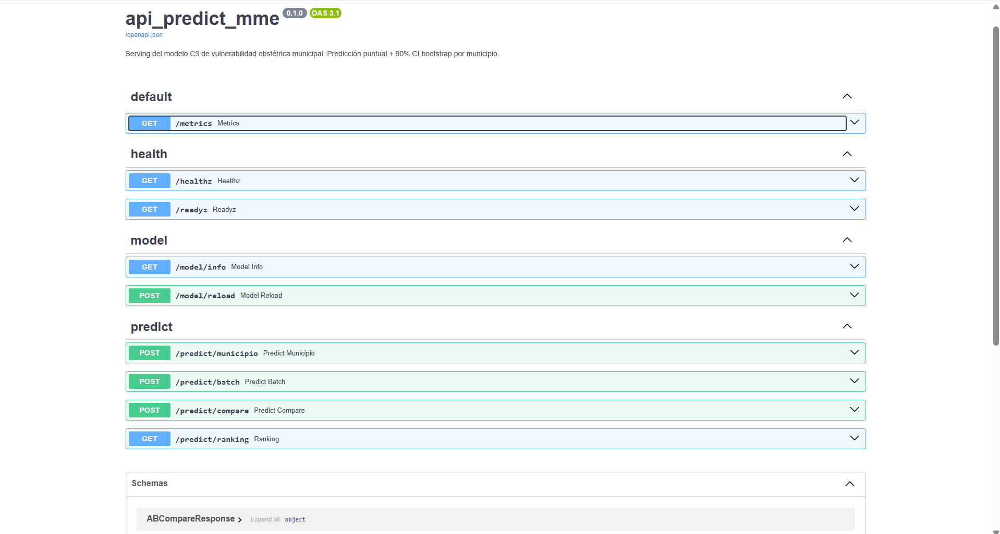

<!-- TODO 📸 capturar request a /predict/municipio con cod_mpio=05001 y la respuesta JSON con razon_predicha, ci_low_90, ci_high_90 y tier -->

Detalle: [docs/api.md](docs/api.md).

### Next.js 14 — `frontend-mme`

3 vistas:

- `/mme` — mapa coroplético Colombia, fill por tier predicho.
- `/mme/explorar` — tabla filtrable + ranking por departamento.
- `/mme/municipio/[cod]` — drill-down con CI plot, SHAP global, histórico observado vs predicho.

Home pública del frontend con glosario clínico y CTAs hacia las 3 vistas:


Vista mapa + ranking departamental (`/mme`):


Vista explorar todos los municipios (`/mme/explorar`):


Drill-down de municipio (`/mme/municipio/[cod]`):

![Drill-down del municipio Palestina (Huila, DIVIPOLA 41530): cards con Casos predichos 9.7 (año 2022), Razón × 1.000 hab = 1.73 con IC 90% [4.6, 15.3] y Predicción puntual con IC bootstrap 200 replicates. Serie temporal 2016-2022 con banda CI sombreada en rojo. Tabla detalle por año con badges de riesgo alto](Soportes_visuales/API_DEPARTAMENTOS_SERIE_TEMPORAL_RAZON%20MME_PREDICJHA.png)

---

## Componentes — Observabilidad

### Prometheus — métricas

16 targets scrapeados (FastAPI, scheduler, triggerer, workers, postgres × 2, MinIO, MLflow, kube-state-metrics, kubelet, apiserver, node-exporter…). Retención 15 días.


### Grafana — dashboards

Datasources preconfigurados: Prometheus + Loki + Tempo (correlación cross-pillar). Dashboards organizados por carpeta (kube-prom-stack out-of-the-box + dashboards custom MME):


Dashboard Kubernetes — Compute Resources (recursos del cluster):


Dashboard Kubernetes — Networking (tráfico del cluster por namespace):


<!-- TODO 📸 capturar Explore → Tempo con un trace de /predict/municipio mostrando spans MLflow + S3 + DB -->

### Loki — logs y alerting

Promtail DaemonSet recolecta stdout de todos los pods. Filtros LogQL típicos en [docs/observability.md](docs/observability.md). Reglas de alerting Loki integradas en Alertmanager:


### Locust — load testing

Mix 10/30/60 healthz/readyz/predict sobre 15 municipios de muestra.


Tabla de estadísticas agregadas (corrida con 60 users, ramp-up de 10 en 10):

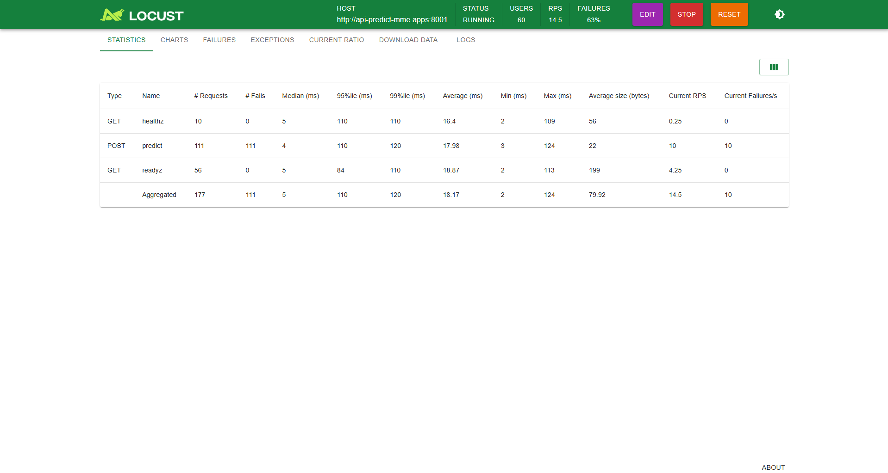

---

## Estructura del repo

```
Vigilancia-Obst-trica-Municipal/
├── code/
│   ├── src/mme/                          Paquete instalable (data, models, eval, drift, tracking)
│   ├── api_predict_mme/                  FastAPI + bootstrap CI residual
│   │   ├── app/                          Routes, services, models pydantic
│   │   ├── Dockerfile                    OpenTelemetry distro auto-instrumented
│   │   └── tests/
│   ├── frontend_mme/                     Next.js 14 App Router
│   ├── proyecto_01/
│   │   ├── airflow/
│   │   │   ├── dags_mme/                 DAGs MME (0/1/2)
│   │   │   └── Dockerfile                Imagen custom con scripts/ + paquete mme
│   │   ├── mlflow/                       Imagen custom MLflow + auth
│   │   ├── jupyterlab/                   Imagen custom con paquete mme RO
│   │   └── locust/                       locustfile.py
│   ├── scripts/mme/                      Ingesta bronze + builders silver/gold + backtest
│   ├── tests/                            pytest suites (unit + integration)
│   └── docs/mme/                         Documentación académica
│       ├── ml-problem-definition.md
│       ├── model-evaluation.md
│       ├── features-spec-v1.md
│       ├── mlops-plan.md
│       ├── dane-eevv-procedure.md
│       └── NEXT-STEPS.md
├── docs/                                 MkDocs Material → GitHub Pages
│   ├── index.md
│   ├── architecture.md
│   ├── data-sources.md
│   ├── dags.md
│   ├── api.md
│   ├── gitops.md
│   ├── ci-cd.md
│   ├── observability.md
│   └── runbook.md
├── k8s/
│   ├── .env.example                      Plantilla de credenciales (NO commitear .env)
│   ├── infra/                            Helm values (postgres × 2, minio, mlflow, airflow)
│   ├── apps/                             Manifests propios (api, frontend, jupyter, pgadmin)
│   ├── argo-cd/
│   │   ├── app-of-apps.yaml              Aplicación raíz
│   │   └── apps/                         12 Application CRs
│   └── scripts/                          Bootstrap, render-env, dns-patch, show-urls
├── .github/workflows/
│   ├── build-and-push.yml                Build matrix → Docker Hub
│   ├── bump-image-tags.yml               Auto-bump tags + commit
│   └── docs.yml                          MkDocs → GitHub Pages
└── mkdocs.yml
```

---

## Pre-requisitos

- Ubuntu 22.04+ (o WSL2 con `.wslconfig` apropiado para evitar OOM con stacks paralelos).
- microk8s 1.28+ con add-ons: `dns`, `hostpath-storage`, `metallb`, `metrics-server`, `ingress`, `observability`.
- 16 GB RAM mínimo (recomendado 32 GB con stack completo).
- `git`, `bash`, `kubectl` (alias del microk8s).
- Cuenta Docker Hub (público OK con `luisfrontuso10/*`).

---

## Despliegue paso a paso

### 1. Clonar y configurar `.env`

```bash
git clone https://github.com/ftuga/Vigilancia-Obst-trica-Municipal.git
cd Vigilancia-Obst-trica-Municipal
cp k8s/.env.example k8s/.env
# Editar k8s/.env: passwords, MICROK8S_NODE_IP=<NODE_IP>, etc.
```

### 2. Bootstrap

```bash
microk8s kubectl apply -f k8s/infra/00-namespaces.yaml
bash k8s/scripts/01-bootstrap-secrets.sh
bash k8s/scripts/02-render-env-configmap.sh
bash k8s/scripts/03-bootstrap-observability.sh
```

### 3. ArgoCD app-of-apps

```bash
microk8s helm repo add argo https://argoproj.github.io/argo-helm
microk8s helm install argocd argo/argo-cd -n argocd --create-namespace

microk8s kubectl apply -f k8s/argo-cd/repos.yaml
microk8s kubectl apply -f k8s/argo-cd/app-of-apps.yaml
```

ArgoCD sincroniza el orden: postgres × 2 → MinIO → MLflow → Airflow → API → frontend → Jupyter → pgAdmin → Locust.

### 4. Patch DNS (microk8s sobre WSL2 con search domain corporativo)

```bash
bash k8s/scripts/apply-airflow-dns-patch.sh
```

### 5. Validar y obtener URLs

```bash
bash k8s/scripts/show-urls.sh
```

Imprime URLs + credenciales de los 11 servicios. **No comitear ese output.**

### 6. Disparar pipeline ML

```bash
SCHED=$(microk8s kubectl get pods -n airflow -l component=scheduler -o jsonpath='{.items[0].metadata.name}')

# DAG 1 — ETL
microk8s kubectl exec -n airflow "$SCHED" -c scheduler -- airflow dags unpause 1-mme_etl_medallion
microk8s kubectl exec -n airflow "$SCHED" -c scheduler -- airflow dags trigger 1-mme_etl_medallion

# DAG 2 — train + promote
microk8s kubectl exec -n airflow "$SCHED" -c scheduler -- airflow dags unpause 2-mme_train_and_promote
microk8s kubectl exec -n airflow "$SCHED" -c scheduler -- airflow dags trigger 2-mme_train_and_promote
```

Cuando DAG 2 termine, validar:

```bash
API_POD=$(microk8s kubectl get pods -n apps -l app.kubernetes.io/name=api-predict-mme -o jsonpath='{.items[0].metadata.name}')
microk8s kubectl exec -n apps "$API_POD" -- python -c \
  'import urllib.request,json; print(json.dumps(json.loads(urllib.request.urlopen("http://localhost:8001/readyz").read()),indent=2))'
```

Status `ok` confirma champion cargado y panel disponible.

---

## Configuración de red y acceso

NodePorts expuestos al host (reemplazar `<NODE_IP>` por la IP del nodo):

| Servicio | Puerto | URL |
|---|---:|---|
| Airflow webserver | 30080 | `http://<NODE_IP>:30080` |
| MLflow tracking | 30500 | `http://<NODE_IP>:30500` |
| MinIO API | 30900 | `http://<NODE_IP>:30900` |
| MinIO console | 30901 | `http://<NODE_IP>:30901` |
| api-predict-mme | 30601 | `http://<NODE_IP>:30601` |
| frontend-mme | 30602 | `http://<NODE_IP>:30602` |
| JupyterLab | 30888 | `http://<NODE_IP>:30888` |
| pgAdmin | 30050 | `http://<NODE_IP>:30050` |
| Grafana | 30030 | `http://<NODE_IP>:30030` |
| Prometheus | 30090 | `http://<NODE_IP>:30090` |
| Locust | 30089 | `http://<NODE_IP>:30089` |
| ArgoCD (port-forward) | 8080 | `microk8s kubectl port-forward -n argocd svc/argocd-server 8080:443` |

Comunicación entre servicios (DNS interno cluster):

```
api-predict-mme.apps:8000  ← consumido por frontend-mme (server actions)
mlflow-tracking.mlflow:80  ← consumido por api-predict-mme + airflow workers
minio.data:9000            ← consumido por mlflow + airflow
postgres-airflow.airflow:5432
postgres-mlflow.mlflow:5432
tempo.observability:4317   ← OTLP gRPC
```

---

## Comandos útiles

```bash
# Estado general
microk8s kubectl get pods -A
microk8s kubectl get app -n argocd

# Ver URLs y credenciales
bash k8s/scripts/show-urls.sh

# Re-aplicar fix DNS tras rotación de pods Airflow
bash k8s/scripts/apply-airflow-dns-patch.sh

# Re-render ConfigMap mme-env (si tocás .env)
bash k8s/scripts/02-render-env-configmap.sh

# Estado de DAG runs
SCHED=$(microk8s kubectl get pods -n airflow -l component=scheduler -o jsonpath='{.items[0].metadata.name}')
microk8s kubectl exec -n airflow "$SCHED" -c scheduler -- airflow dags list-runs -d 2-mme_train_and_promote

# Reset completo (borra PVCs, MinIO buckets, MLflow registry)
microk8s kubectl exec -n airflow "$SCHED" -c scheduler -- airflow variables set confirm_reset YES
microk8s kubectl exec -n airflow "$SCHED" -c scheduler -- airflow dags trigger 0-mme_reset_environment

# Forzar sync ArgoCD
microk8s kubectl patch app <nombre> -n argocd --type merge -p '{"operation":{"sync":{}}}'
```

---

## Troubleshooting

| Síntoma | Causa | Fix |
|---|---|---|
| Airflow workers en CrashLoopBackOff | bug Celery + Airflow 2.10.5 (`pidfile=None`) | bypass: `workers.args` invoca `celery worker` directo |
| DAG 1 ingesta falla con `SSLError self-signed` | DNS hijack via search domain corporativo | `bash k8s/scripts/apply-airflow-dns-patch.sh` (`ndots:1`) |
| `/readyz` degraded `feature_set no encontrado` | API sin acceso al PVC | verificar mount `/opt/airflow/data/mme` y env `MME_REPORTS_ROOT` |
| WSL muere y `dmesg` vacío al reboot | OOM por stacks paralelos (Compose + microk8s) | bajar uno + crear `C:\Users\<user>\.wslconfig` con memory/swap |
| pgAdmin rechaza email `@*.local` | `email_validator` bloquea TLDs no-deliverable | usar dominio `.dev` o `.com` |
| ArgoCD app `OutOfSync` recurrente en Secret | bitnami auto-genera password | agregar `ignoreDifferences` con jsonPointer al Secret |

---

## Documentación

- **Sitio MkDocs deployado**: `https://ftuga.github.io/Vigilancia-Obst-trica-Municipal/` (build automático on push a `docs/**`).
- **Arquitectura**: [docs/architecture.md](docs/architecture.md)
- **Datos y medallón**: [docs/data-sources.md](docs/data-sources.md)
- **DAGs y lineage**: [docs/dags.md](docs/dags.md)
- **API + Frontend**: [docs/api.md](docs/api.md)
- **GitOps**: [docs/gitops.md](docs/gitops.md)
- **CI/CD**: [docs/ci-cd.md](docs/ci-cd.md)
- **Observabilidad**: [docs/observability.md](docs/observability.md)
- **Runbook**: [docs/runbook.md](docs/runbook.md)
- **Seguridad**: [docs/security.md](docs/security.md)
- **ADRs**: [docs/adrs.md](docs/adrs.md)
- **Documentación académica**: [code/docs/mme/](code/docs/mme/) — `ml-problem-definition.md`, `model-evaluation.md`, `features-spec-v1.md`, `mlops-plan.md`, `dane-eevv-procedure.md`, `NEXT-STEPS.md`.

---

## Restricciones metodológicas (no negociables)

- **Ecological fallacy**: el modelo es municipal. SHAP individual ≠ riesgo de una mujer concreta. Disclaimer obligatorio en UI.
- **MAUP**: resultados se reportan a 2 escalas (muni + dpto).
- **Clayton-Kaldor empirical Bayes**: obligatorio para muni con NV<50/año.
- **Split temporal estricto**: train ≤2020 / val 2021 / test 2022. Nunca random split.
- **Ley 1581 Habeas Data**: todo agregado municipal, anonimizado por INS upstream.

Detalle completo: [code/docs/mme/ml-problem-definition.md](code/docs/mme/ml-problem-definition.md).

---

## Contexto

- Pivot a foco MME 2026-04-23. Proyecto previo de detección de rug pulls DeFi queda archivado en `ent_tesis` (privado).
- Marco normativo: Resolución 3280/2018 MinSalud (Ruta Materno Perinatal), PAREMM v5, SIRENAGEST.
- Criterios clínicos OMS/FLASOG de inclusión MME (enfermedad específica, disfunción orgánica, manejo).

