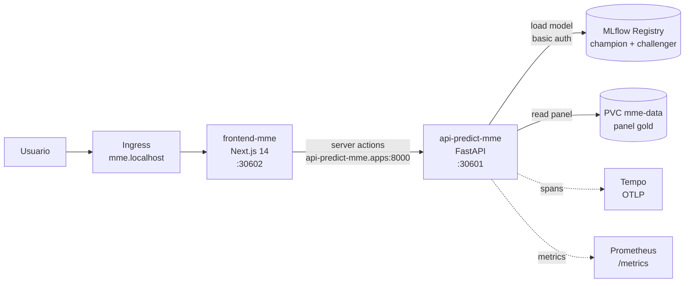

# Capa de serving — API + Frontend

Capa de inferencia online sobre el modelo `mme_vulnerability_baseline@champion`. Compuesta por `api-predict-mme` (FastAPI) y `frontend-mme` (Next.js 14). Ambas en `ns: apps`, sincronizadas por ArgoCD, con rolling updates automáticos cuando GHA bumpea tags.

## Topología



## API `api-predict-mme`

### Stack

- FastAPI + Uvicorn workers.
- `mlflow.pyfunc.load_model("models:/mme_vulnerability_baseline@champion")` al startup.
- Panel `panel_muni_semestre.parquet` cargado en memoria (15.708 filas × 14 cols) — refresh on-demand vía `/model/reload`.
- Bootstrap CI residual al 90% por predicción (n=200, seed=42).
- HPA 1–4 réplicas (CPU 70%, memory 80%).

### Endpoints

| Método | Path | Descripción |
|---|---|---|
| GET | `/healthz` | Liveness — siempre 200 si proceso vivo |
| GET | `/readyz` | Readiness — `ok` solo si champion cargado y panel disponible |
| GET | `/model/info` | Versión, alias, run_id, fecha de entrenamiento |
| POST | `/model/reload` | Recarga champion desde MLflow (sin restart) |
| POST | `/predict/municipio` | 1 muni → razón predicha + CI bootstrap + tier |
| POST | `/predict/batch` | N muni en una sola llamada |
| POST | `/predict/compare` | A/B champion vs challenger (dual inference) |
| GET | `/predict/ranking?departamento=05` | Top-K muni del departamento ordenados por razón predicha |

### Contrato `/predict/municipio`

```json
// request
{ "cod_mpio": "05001", "anio": 2023, "semestre": 1 }

// response
{
  "cod_mpio": "05001",
  "anio": 2023,
  "semestre": 1,
  "razon_predicha": 8.42,
  "ci_low_90": 6.11,
  "ci_high_90": 11.05,
  "tier": "alta",
  "champion_run_id": "abc123…",
  "panel_version": "2026-04-25"
}
```

`tier` se deriva del p80 nacional histórico (`alta` ≥ p80, `media` p50–p80, `baja` < p50).

### Contrato `/predict/compare` (A/B champion vs challenger)

```json
// request
{ "cod_mpio": "05001", "anio": 2023, "semestre": 1 }

// response
{
  "cod_mpio": "05001",
  "champion": { "razon_predicha": 8.42, "ci_low_90": 6.11, "ci_high_90": 11.05, "run_id": "abc..." },
  "challenger": { "razon_predicha": 7.98, "ci_low_90": 5.84, "ci_high_90": 10.62, "run_id": "def..." },
  "delta_pct": -5.2
}
```

Habilita comparación side-by-side antes de promover un challenger. Si no hay alias `challenger` en el Registry, devuelve 503 con detalle.

### Carga de modelo

```python
# resumen — código real en code/api_predict_mme/app/services/model_store.py
mlflow.set_tracking_uri(MLFLOW_TRACKING_URI)        # http://mlflow-tracking.mlflow:80
client = MlflowClient()
mv = client.get_model_version_by_alias(MODEL_NAME, "champion")
model = mlflow.pyfunc.load_model(f"models:/{MODEL_NAME}@champion")
```

Auth básica al MLflow tracking via Secret `mlflow-auth` (envFrom en el deployment). Auth a MinIO via Secret `mlflow-s3` (`AWS_ACCESS_KEY_ID`, `AWS_SECRET_ACCESS_KEY`, `MLFLOW_S3_ENDPOINT_URL`).

### Variables de entorno relevantes

| Var | Origen | Función |
|---|---|---|
| `API_MME_MLFLOW_TRACKING_URI` | deployment env | URI interno MLflow |
| `MLFLOW_REGISTRY_MODEL_NAME` | ConfigMap `mme-env` | `mme_vulnerability_baseline` |
| `MME_REPORTS_ROOT` | ConfigMap | `/opt/airflow/data/mme/gold` (mount PVC) |
| `MLFLOW_TRACKING_USERNAME/PASSWORD` | Secret `mlflow-auth` | Basic auth registry |
| `OTEL_EXPORTER_OTLP_ENDPOINT` | ConfigMap | `http://tempo.observability:4317` |

### Observabilidad

- **Métricas**: Prometheus scrape `/metrics` (Histogram `http_request_duration_seconds`, Counter `http_requests_total`, Gauge `mme_model_version_info`).
- **Trazas**: OpenTelemetry distro auto-instrumenta FastAPI + httpx + requests. Spans incluyen MLflow API, MinIO download, panel lookup. Service name `api-predict-mme`.
- **Logs**: stdout JSON estructurado → Loki via Promtail.

## Frontend `frontend-mme`

### Stack

- Next.js 14 App Router.
- Tailwind + Recharts.
- Server Actions consumen la API por DNS interno (`api-predict-mme.apps:8000`) — el browser nunca toca la API directo.
- 3 vistas:
  - `/mme` — mapa coroplético Colombia, fill por tier predicho.
  - `/mme/explorar` — tabla filtrable + ranking por dpto.
  - `/mme/municipio/[cod]` — drill-down con CI plot, contributing features (SHAP global), histórico observado vs predicho.

### Configuración

| Var | Función |
|---|---|
| `API_PREDICT_MME_URL` | URL interna de la API (server-side fetch) |
| `NEXT_PUBLIC_BASE_PATH` | base path Ingress |

NodePort 30602 + Ingress `mme.localhost`.

## A/B testing y rollback

1. Entrenar challenger en branch → disparar DAG 2 con override `model_alias=challenger`.
2. Promover via `mlflow_ops.set_alias("challenger", new_version)`.
3. Comparar via `/predict/compare` para muestra de muni representativos.
4. Si pasa gates manuales → reasignar alias `champion` al nuevo version.
5. POST `/model/reload` en la API → carga nuevo champion sin restart.

Rollback: re-asignar alias `champion` a la versión previa + `/model/reload`. Tiempo total estimado < 30s.

## Dependencias

- MLflow registry sincronizado y con champion alias activo (DAG 2 success).
- PVC `mme-data` montado RWX con `panel_muni_semestre.parquet` no vacío.
- Secret `mlflow-auth` y `mlflow-s3` replicados en `ns: apps`.

`/readyz` agrega los 3 chequeos. Si alguno falla → estado `degraded` con detalle del subsistema.
