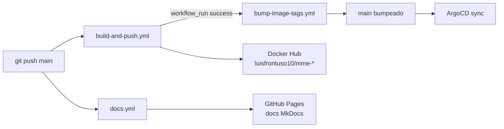

# CI/CD pipeline

3 workflows GitHub Actions cubren build, bump y docs. Push a `main` dispara la cadena completa; ArgoCD reconcilia el cluster cuando los manifests cambian.



## Workflow 1 — `build-and-push.yml`

Build matrix multi-arch (amd64+arm64 donde aplica) → push a Docker Hub.

**Trigger**:

```yaml
on:
  push:
    branches: [main]
    paths: ['code/**', '.github/workflows/build-and-push.yml']
  workflow_dispatch:
    inputs:
      service: [api-predict, frontend, airflow, mlflow, jupyterlab]
```

**Matrix** (5 imágenes en paralelo):

| `name` | `context` | `dockerfile` | Image |
|---|---|---|---|
| `api-predict` | `code/api_predict_mme/` | `Dockerfile` | `luisfrontuso10/mme-api-predict` |
| `frontend` | `code/frontend_mme/` | `Dockerfile` | `luisfrontuso10/mme-frontend` |
| `airflow` | `code/proyecto_01/airflow/` | `Dockerfile` | `luisfrontuso10/mme-airflow` |
| `mlflow` | `code/proyecto_01/mlflow/` | `Dockerfile` | `luisfrontuso10/mme-mlflow` |
| `jupyterlab` | `code/proyecto_01/jupyterlab/` | `Dockerfile` | `luisfrontuso10/mme-jupyterlab` |

**Tagging** (job `compute-tag`):

```bash
# main
DATE=$(date -u +%Y%m%d); SHORT_SHA=${GITHUB_SHA::7}
tag="${DATE}-${SHORT_SHA}"        # ej: 20260425-779ce7c

# branch
SAFE_BRANCH=$(echo "$GITHUB_REF_NAME" | tr '/' '-')
tag="${SAFE_BRANCH}-${SHORT_SHA}"  # ej: feat-new-feature-abc1234
```

Cada imagen recibe 2 tags: el calculado + `latest` (solo en main).

**Características**:

- Build paralelo (`fail-fast: false`).
- `docker/build-push-action@v5` con caché GHA (`cache-from: type=gha, cache-to: type=gha,mode=max`).
- Multi-arch via QEMU + buildx (api/frontend/jupyterlab → amd64+arm64; airflow/mlflow → solo amd64 por restricciones de upstream).
- Login Docker Hub con secrets `DOCKERHUB_USERNAME` + `DOCKERHUB_TOKEN`.
- Concurrency `build-${{ github.ref }}` con `cancel-in-progress: false` (evita carreras pero permite reintento manual).

## Workflow 2 — `bump-image-tags.yml`

Después de un build exitoso, actualiza los tags en los manifests Kubernetes y commit a main.

**Trigger**:

```yaml
on:
  workflow_run:
    workflows: ['Build and Push to Docker Hub']
    types: [completed]
  workflow_dispatch:
    inputs:
      tag: { description: 'Tag manual (override)' }
```

**Job único `bump`**:

1. Recompute tag = `YYYYMMDD-{HEAD_SHA::7}`.
2. `sed -i` sobre cada manifest target:
   ```bash
   k8s/apps/api-predict-mme/deployment.yaml
   k8s/apps/frontend-mme/deployment.yaml
   k8s/apps/jupyterlab/deployment.yaml
   ```
3. `git diff --quiet` → si hay cambios, commit con mensaje:
   ```
   chore(k8s): bump image tags to <tag>
   ```
4. `git push origin main` con `GITHUB_TOKEN`.

**Por qué solo 3 apps**: Airflow y MLflow se buildean con tags pero el bump al chart values (`k8s/infra/<chart>-values.yaml`) sigue siendo manual — cambia la imagen base del chart Helm, no un Deployment custom.

**Concurrency**: `bump-tags-main` con `cancel-in-progress: false`. Si dos pushes a main ocurren rápido, los bumps se serializan.

## Workflow 3 — `docs.yml`

Build MkDocs Material → deploy a GitHub Pages.

**Trigger**:

```yaml
on:
  push:
    branches: [main]
    paths: ['docs/**', 'mkdocs.yml', '.github/workflows/docs.yml']
  workflow_dispatch:
```

**Pipeline**:

```yaml
- pip install mkdocs-material pymdown-extensions
- mkdocs build --strict      # falla si hay broken links
- upload-pages-artifact path=site/
- deploy-pages
```

`--strict` bloquea el deploy si hay enlaces internos rotos o referencias faltantes — gate de calidad.

## Secrets requeridos

| Secret | Workflow | Uso |
|---|---|---|
| `DOCKERHUB_USERNAME` | build-and-push | login registro |
| `DOCKERHUB_TOKEN` | build-and-push | PAT scope read+write+delete |
| `GITHUB_TOKEN` | bump-image-tags, docs | auto-provisto, scope `contents:write` + `pages:write` |

Configurar:

```bash
gh secret set DOCKERHUB_USERNAME --body "luisfrontuso10"
gh secret set DOCKERHUB_TOKEN --body "<PAT>"
```

## Permisos GitHub Actions

```yaml
# build-and-push.yml
permissions:
  contents: read

# bump-image-tags.yml
permissions:
  contents: write    # commit + push

# docs.yml
permissions:
  contents: read
  pages: write
  id-token: write    # OIDC para deploy-pages
```

## Path filters — qué dispara qué

| Cambio en | Dispara |
|---|---|
| `code/api_predict_mme/**` | build-and-push (api-predict) → bump (api-predict-mme deployment) |
| `code/frontend_mme/**` | build-and-push (frontend) → bump |
| `code/proyecto_01/airflow/**` | build-and-push (airflow). Bump manual del chart values. |
| `code/proyecto_01/mlflow/**` | build-and-push (mlflow). Bump manual. |
| `docs/**` o `mkdocs.yml` | docs.yml |
| `k8s/**` | nada en CI; ArgoCD lo reconcilia directo |

## Tiempos típicos

| Etapa | Duración |
|---|---|
| `compute-tag` | <5s |
| build api-predict (con caché) | 1m20s |
| build frontend | 1m45s |
| build airflow (cold) | 4m30s |
| bump-image-tags | 25s |
| ArgoCD detect + sync | 3m (poll) + 30s (apply) |
| Rolling update K8s | 30–60s |
| **Push → producción (api/frontend)** | **~5–7 min** |

## Rollback

Sin botón mágico — operación manual:

1. `git revert <sha>` del commit problemático, o `git revert <sha-bump>` si solo se quiere revertir el deploy sin tocar código.
2. Push → bump-image-tags ya no se dispara (no hay rebuild), pero ArgoCD reconcilia el manifest revertido.
3. ArgoCD aplica el tag previo → rolling update inverso.

Para rollback más rápido del modelo (sin cambiar imagen): re-asignar alias `champion` en MLflow + POST `/model/reload`. Ver [api.md §A/B testing y rollback](api.md#ab-testing-y-rollback).
