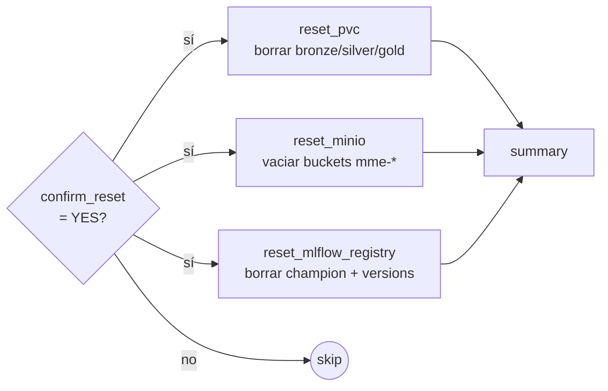
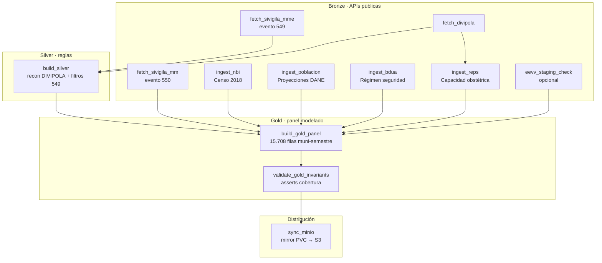
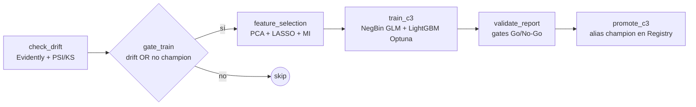

# DAGs y data lineage

Tres DAGs Airflow orquestan el ciclo completo: reset (manual), ETL medallón (diario), training+promote (diario).

## DAG 0 — `0-mme_reset_environment`

Manual-only. Limpieza idempotente para probar boot from scratch.



**Gate**: requiere Airflow Variable `confirm_reset=YES` para evitar disparos accidentales.

## DAG 1 — `1-mme_etl_medallion`

Diario 02:00 UTC. Ingesta multi-fuente paralela → silver → gold panel municipal-semestre.



**Salida**: `panel_muni_semestre.parquet` en PVC `mme-data` y MinIO bucket `mme-gold`.

## DAG 2 — `2-mme_train_and_promote`

Diario 04:00 UTC (2 h después de DAG 1). Pipeline de modelado completo.



**Gates Go/No-Go en `validate_report`**:

| Métrica | Umbral |
|---|---|
| `test_spearman_dpto` | ≥ 0.30 |
| `test_precision_at_50` | ≥ 0.08 |
| `r2_log_counts` | > 0 |
| `overfit_gap` (val→test) | ≤ 0.20 |
| `mae_razon` | finito |

**Promoción** vía `mme.tracking.mlflow_ops.promote_champion()`: gate combinado `new ≥ prev × tolerance OR new ≥ absolute_floor`. Tolerance default 0.95, floor 0.65.

## Lineage de datos

```mermaid
flowchart LR
    subgraph "Fuentes externas"
        SVG[datos.gov.co<br/>SIVIGILA]
        DANE[dane.gov.co<br/>Censo + Proyecciones]
        DIVI[INS<br/>DIVIPOLA]
    end

    subgraph "Bronze · raw parquet"
        BRZ[mme-bronze/<br/>year=*/part-*.parquet]
    end

    subgraph "Silver · clean"
        SLV[mme-silver/<br/>mme_clean.parquet]
    end

    subgraph "Gold · panel modelado"
        GLD[mme-gold/<br/>panel_muni_semestre.parquet]
    end

    subgraph "Modelo"
        FS[feature_set_v1.json]
        MOD[mme_vulnerability_baseline<br/>@champion · MLflow]
    end

    subgraph "Serving"
        API[/predict?cod_mpio=05001/]
    end

    SVG --> BRZ
    DANE --> BRZ
    DIVI --> BRZ
    BRZ --> SLV
    SLV --> GLD
    GLD --> FS
    FS --> MOD
    MOD --> API
    GLD --> API
```
