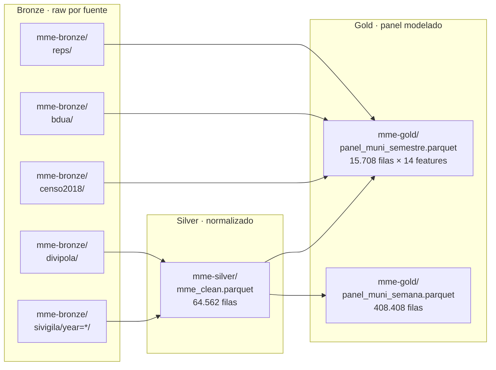

# Dataset y fuentes de datos

8 fuentes 100% públicas, sin trámite institucional. Todas se ingestan en bronze por el DAG 1 y se reconcilian contra el catálogo DIVIPOLA antes de pasar a silver.

## Catálogo de fuentes

| Fuente | ID / Endpoint | Custodio | Frecuencia | Uso en el modelo |
|---|---|---|---|---|
| SIVIGILA evento 549 — MME | Socrata `4hyg-wa9d` | INS | semanal | **Outcome principal** (`y = casos_mme`) |
| SIVIGILA evento 550 — Mortalidad Materna | Socrata `4hyg-wa9d` (filtro evento) | INS | semanal | Letalidad + validación cruzada |
| DIVIPOLA municipios | Socrata `gdxc-w37w` | DANE | anual | Catálogo canónico (1.122 muni × 33 dpto) |
| DIVIPOLA departamentos | Socrata `vcjz-niiq` | DANE | anual | Reconciliación dpto |
| CNPV 2018 — NBI | `dane.gov.co/files/censo2018/.../CNPV-2018-NBI.xlsx` | DANE | estática (censo) | Feature Demora I-II (vulnerabilidad estructural) |
| CNPV 2018 — Población ajustada | `dane.gov.co/.../CNPV-2018-Poblacion-Ajustada-por-Cobertura.xls` | DANE | estática | Offset poblacional + ruralidad |
| BDUA | Socrata `hn4i-593p` | MinSalud | mensual | Cobertura régimen seguridad |
| REPS — capacidad obstétrica | Socrata `ugc5-acjp` + `s2ru-bqt6` | MinSalud | mensual | Feature Demora III (oferta IPS) |
| EEVV nacimientos (opcional) | `microdatos.dane.gov.co` (descarga manual) | DANE | anual | Denominador NV exacto (fallback: pob/2) |

## Medallón

## Reglas de calidad (silver)

- **Filtro evento 549** estricto (descarta cierres administrativos sin caso).
- **Reconciliación DIVIPOLA**: codes `cod_mpio` y `cod_dpto` se normalizan a string con `zfill(5)` y `zfill(2)`.
- **Anti-duplicados**: deduplicación por `(id_caso, fecha_inicio_sintomas, cod_mpio)`.
- **Año fuera de ventana** (≠ 2016–2022) → drop con log.

Ver invariantes completos en `code/scripts/mme/build_silver.py`.

## Reglas de armado del panel (gold)

- Granularidad: `muni × semestre`, 1.122 muni × 2 semestres × 7 años = **15.708 filas**.
- 14 features finales seleccionadas con PCA + LASSO + MI (ver `code/docs/mme/features-spec-v1.md`).
- Offset poblacional `log(NV_esperados)`. Si EEVV no disponible → fallback `log(pob/2)`.
- Validación post-build con `validate_gold_invariants` (cobertura municipal ≥ 95%, sin nulos en target, totales departamentales ≤ 5% drift vs INS).

## Persistencia y distribución

| Capa | Path PVC `mme-data` | MinIO bucket | Retención |
|---|---|---|---|
| bronze | `/opt/airflow/data/mme/bronze/<src>/year=*/` | `mme-bronze` | 90 días |
| silver | `/opt/airflow/data/mme/silver/` | `mme-silver` | 180 días |
| gold | `/opt/airflow/data/mme/gold/` | `mme-gold` | indefinido |

`sync_minio` del DAG 1 hace mirror PVC → S3 al final del run. La API lee gold desde el PVC compartido (mount RWX en el namespace `apps`).

## Restricciones metodológicas

- **Ecological fallacy**: el modelo es municipal. SHAP individual ≠ riesgo de una mujer concreta. Disclaimer obligatorio en UI.
- **MAUP**: resultados se reportan a 2 escalas (muni + dpto). Spearman dpto = 0.836 sobre test 2022.
- **Clayton-Kaldor empirical Bayes**: obligatorio para muni con NV<50/año.
- **Split temporal estricto**: train ≤2020 / val 2021 / test 2022. Nunca random split.
- **Ley 1581 Habeas Data**: todo agregado municipal, anonimizado por INS upstream.
