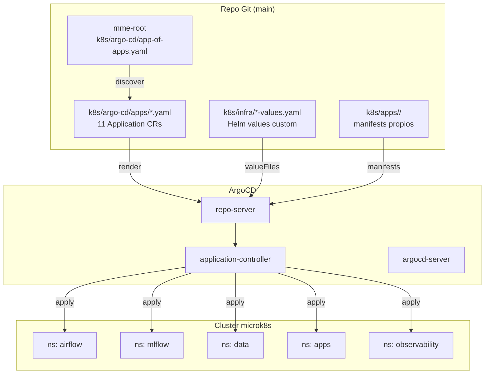

# GitOps con ArgoCD

Reconciliación continua del cluster contra `git@github.com:ftuga/Vigilancia-Obst-trica-Municipal`. Patrón **App-of-Apps** + **multi-source** para charts upstream con values en este repo. Sin `kubectl apply` manual en producción.

## Topología



## App-of-Apps

`k8s/argo-cd/app-of-apps.yaml` es la única `Application` aplicada manualmente. Apunta al directorio `k8s/argo-cd/apps/` y descubre automáticamente las apps hijas.

```yaml
apiVersion: argoproj.io/v1alpha1
kind: Application
metadata:
  name: mme-root
  namespace: argocd
spec:
  source:
    repoURL: https://github.com/ftuga/Vigilancia-Obst-trica-Municipal
    targetRevision: main
    path: k8s/argo-cd/apps
  destination:
    server: https://kubernetes.default.svc
    namespace: argocd
  syncPolicy:
    automated: { prune: true, selfHeal: true }
```

Agregar un servicio nuevo = crear `k8s/argo-cd/apps/<nombre>.yaml` y commit. ArgoCD lo reconoce en el próximo poll (3 min).

## Apps gestionadas

| App | Tipo | Namespace | Sync policy |
|---|---|---|---|
| `postgres-airflow` | Helm (bitnamilegacy/postgresql) | `airflow` | automated, self-heal |
| `postgres-mlflow` | Helm (bitnamilegacy/postgresql) | `mlflow` | automated, self-heal |
| `minio` | Helm (bitnamilegacy/minio) | `data` | automated, self-heal |
| `mlflow` | Helm (bitnamilegacy/mlflow) | `mlflow` | automated, self-heal |
| `airflow` | Helm (apache-airflow/airflow) | `airflow` | automated, **manual prune** |
| `airflow-pvcs` | manifests propios | `airflow` | automated, self-heal |
| `api-predict-mme` | manifests propios | `apps` | automated, self-heal |
| `frontend-mme` | manifests propios | `apps` | automated, self-heal |
| `jupyterlab` | manifests propios | `apps` | automated, self-heal |
| `pgadmin` | manifests propios | `apps` | automated, self-heal |
| `locust` | manifests propios | `observability` | automated, self-heal |
| `observability-extras` | manifests propios | `observability` | automated, self-heal |

`airflow` no tiene `prune: true` porque el chart genera ServiceAccount + Role transitorios que ArgoCD no debe borrar entre syncs.

## Multi-source para charts upstream

Charts oficiales sin valores inline en `Application.spec.helm.values`. En su lugar, **dos sources** por app: el chart repo + este repo (con `ref: values`).

```yaml
# k8s/argo-cd/apps/mlflow.yaml (resumido)
spec:
  sources:
    - chart: mlflow
      repoURL: oci://registry-1.docker.io/bitnamicharts
      targetRevision: 3.3.2
      helm:
        valueFiles:
          - $values/k8s/infra/mlflow-values.yaml
    - repoURL: https://github.com/ftuga/Vigilancia-Obst-trica-Municipal
      targetRevision: main
      ref: values
```

**Trade-off vs. fork del chart:**
- ✓ Single source of truth para values (este repo).
- ✓ Sin acoplar ciclo de release del chart con el del proyecto.
- ✗ Complejidad extra del CR (vs. `helm.values` inline).

## Sync policies por tier

| Tier | Apps | Política |
|---|---|---|
| **Datos críticos** | `postgres-airflow`, `postgres-mlflow`, `minio`, `airflow-pvcs` | automated `selfHeal: true`, **sin** `prune: true`. Evita borrar PVCs/StatefulSets accidentalmente. |
| **Plataforma ML** | `mlflow`, `airflow` | automated `selfHeal: true`. Pruning condicional (manual en `airflow`). |
| **Apps producto** | `api-predict-mme`, `frontend-mme`, `jupyterlab`, `pgadmin` | automated full (`selfHeal + prune`). Iteración rápida. |
| **Observabilidad** | `locust`, `observability-extras` | automated full. |

## Reconciliación: cómo viaja un cambio

```
[dev] git push main
   │
   ▼
[GHA build-and-push.yml]   ← build + push imagen → Docker Hub
   │
   ▼
[GHA bump-image-tags.yml]  ← sed -i k8s/apps/<svc>/deployment.yaml
   │                         git commit + push main
   ▼
[main: deployment.yaml con tag nuevo]
   │
   ▼
[ArgoCD poll cada 3 min]   ← detecta diff, sync automated
   │
   ▼
[K8s rolling update]       ← pod nuevo Ready → pod viejo Terminating
```

Tiempo total push → producción: ~5–7 min.

## ignoreDifferences

Helm charts con secrets generados al install rotan diff cada sync (auth.password de bitnami). Patrón aplicado:

```yaml
ignoreDifferences:
  - group: ""
    kind: Secret
    jsonPointers: [/data/postgres-password, /data/admin-password]
```

Documentado por chart en su `Application` correspondiente.

## Operación

| Acción | Comando |
|---|---|
| Listar apps | `microk8s kubectl get app -n argocd` |
| Ver estado de una app | `microk8s kubectl describe app <nombre> -n argocd` |
| Forzar sync manual | `microk8s kubectl patch app <nombre> -n argocd --type merge -p '{"operation":{"sync":{}}}'` |
| Ver UI | `microk8s kubectl port-forward -n argocd svc/argocd-server 8080:443` |

Credencial admin inicial: `microk8s kubectl -n argocd get secret argocd-initial-admin-secret -o jsonpath='{.data.password}' | base64 -d`.

## Limitaciones conocidas

- Bump de imágenes custom de **charts** (`mme-airflow`, `mme-mlflow`, `mme-jupyterlab`) no automatizado. Requiere editar manualmente `image.repository` en `k8s/infra/<chart>-values.yaml` y commit.
- Chart Apache Airflow 1.16.0 no expone `dnsConfig` en values. Workaround: `bash k8s/scripts/apply-airflow-dns-patch.sh` post-sync (idempotente).
- ArgoCD `repo-server` puede consumir RAM elevada con multi-source. Mitigación: `--repo-server-timeout 180s` y caché habilitado por defecto.
