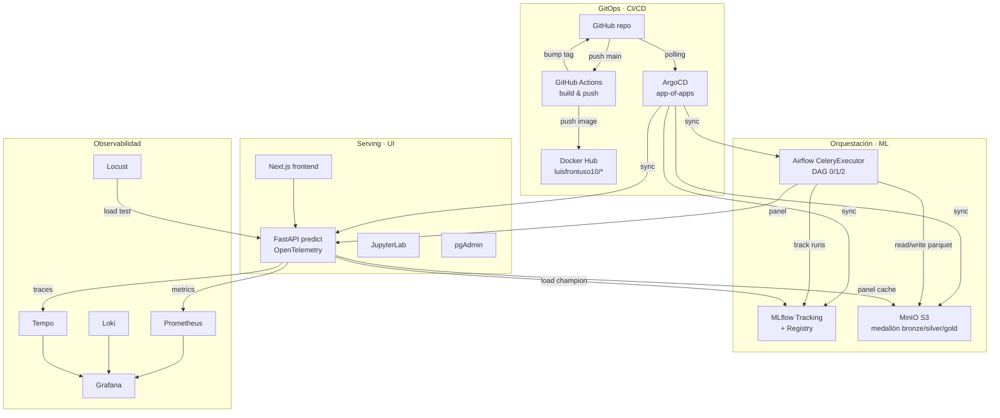

# Vigilancia Obstétrica Municipal · Arquitectura MLOps

Sistema MLOps end-to-end sobre **microk8s single-node** con GitOps (ArgoCD) para predecir vulnerabilidad de mortalidad materna a nivel municipal en Colombia.

!!! info "Foco de la tesis"
    El **dominio MME** (mortalidad materna extrema) es el caso de uso. La contribución principal es la **arquitectura MLOps** desplegable, reproducible y observable sobre Kubernetes.

## Stack desplegado

## Características clave

- **GitOps puro**: cada cambio en `main` dispara CI → ArgoCD reconcilia. Sin `kubectl apply` manual en producción.
- **Pipeline ML completo**: ingesta multi-fuente (DANE, INS, BDUA, REPS) → silver/gold medallón → feature selection PCA+LASSO+MI → entrenamiento NegBin GLM + LightGBM con Optuna → promoción champion via alias MLflow.
- **Observabilidad full-stack**: métricas (Prometheus), logs (Loki), traces (Tempo), load testing (Locust), todo unificado en Grafana.
- **Self-service**: ArgoCD UI, Airflow UI, MLflow UI, JupyterLab, pgAdmin — cada herramienta accesible vía NodePort.

## Próximos pasos

- [Arquitectura detallada](architecture.md)
- [DAGs y data lineage](dags.md)
- [Stack de observabilidad](observability.md)
- [Runbook de deployment](runbook.md)
