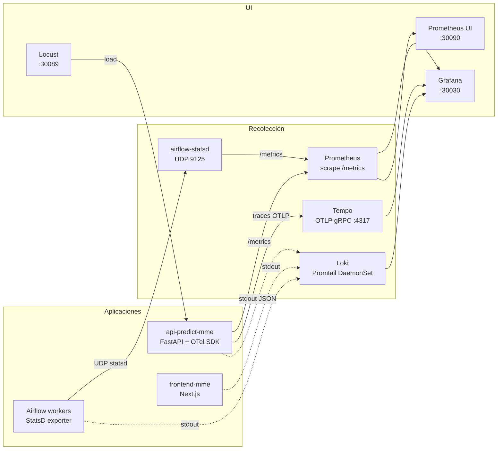

# Stack de observabilidad

Three pillars: **métricas, logs, traces** unificados en Grafana. Carga sintética via Locust.



## Prometheus

- 16 targets scrapeados (kube-state-metrics, kubelet, apiserver, node-exporter, postgres-exporter x2, MinIO, MLflow, FastAPI, scheduler, triggerer, workers, etc).
- Retención default 15 días.
- UI: `http://NODE:30090` (sin auth).

Queries útiles:

```promql
# RPS al API por endpoint
sum(rate(http_requests_total{job="api-predict-mme"}[5m])) by (handler)

# Latencia p99 predict
histogram_quantile(0.99,
  sum(rate(http_request_duration_seconds_bucket{handler="/predict"}[5m])) by (le)
)

# Memoria por pod en namespace apps
sum(container_memory_working_set_bytes{namespace="apps"}) by (pod)
```

## Grafana

- URL: `http://NODE:30030` · admin/`prom-operator`.
- Dashboards default de **kube-prom-stack**: cluster, nodes, pods, namespaces.
- **Datasources** preconfigurados: Prometheus, Loki, Tempo (correlación cross-pillar).

## Tempo

Distributed tracing OTLP. La API FastAPI auto-instrumentada con `opentelemetry-distro`:

- Spans automáticos: HTTP requests entrantes/salientes (`fastapi`, `requests`, `httpx`).
- Propagación W3C Trace Context.
- Service name: `api-predict-mme`.

**Cómo ver traces**:

1. Grafana → Explore → Tempo.
2. Search service `api-predict-mme`.
3. Click un trace → ves el árbol completo: request → MLflow API → S3 download → DB query → response.

## Loki

Logs de todos los pods via Promtail DaemonSet. Filtros LogQL:

```logql
{namespace="apps", pod=~"api-predict-mme.*"} |= "ERROR"
{namespace="airflow"} |~ "DAG run.*failed"
```

## Locust

Load testing del API. UI `http://NODE:30089`.

- `locustfile.py` configurado en ConfigMap (mix 10/30/60 healthz/readyz/predict).
- 15 municipios DIVIPOLA reales de muestra.
- Inicia con N usuarios y ramp-up rate.

**Workflow típico**:

1. Abrí Locust UI.
2. "Start swarming" → 100 users, ramp 10/s, host autodetectado.
3. Mientras corre, abrí Grafana en otra tab → ves RPS, latencia p50/p99, errores.
4. En Tempo, refresá búsqueda → ves traces nuevos.
